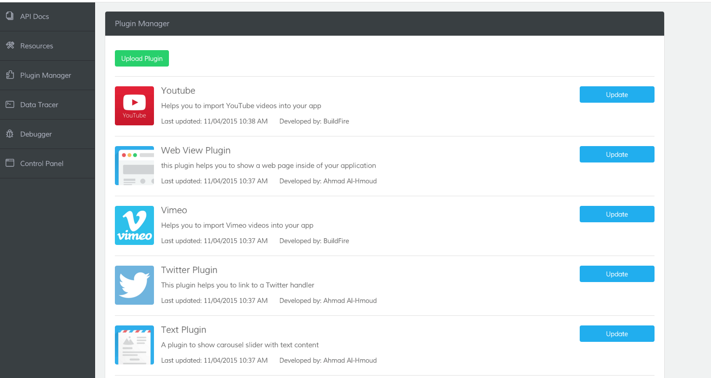
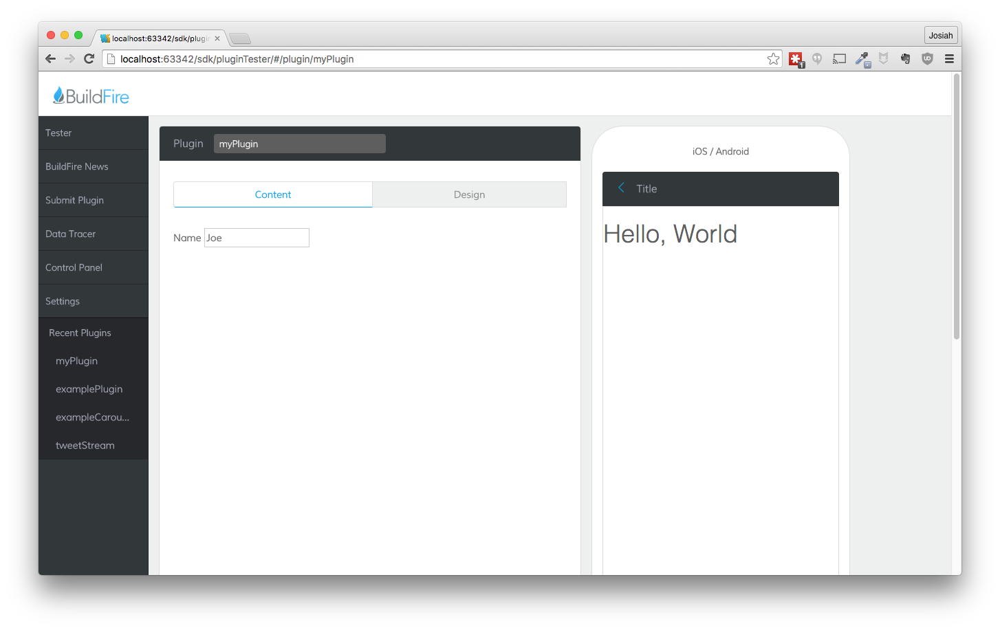

### Up and Running with the BuildFire SDK

The BuildFire SDK allows for developers to make plugins that can be used in BuildFire apps and be sold on the BuildFire platform (in the future). This allows for developers to be able to adapt BuildFire apps to specific use cases of a customer or fill a need which BuildFire’s plugins do not already fill.

#### Sign Up for Developer Program

To get started, we can start by signing up for a developer account at [dev.buildfire.com](http://dev.buildfire.com).

#### Download the SDK

Once signed up, we will need to get the SDK locally on our machine. This will allow us to begin developing in our IDE or editor.

To get the SDK, we then can either download the zip file from the [dev.buildfire.com](http://dev.buildfire.com) page or get it directly from github [here](https://github.com/BuildFire/sdk/archive/master.zip)

Additionally, we could also clone the [repo](https://github.com/BuildFire/sdk) on github. To do this, we will simply need to <code>git clone https://github.com/BuildFire/sdk.git</code> the repository into the folder we want on our machine.

#### Open SDK in IDE or Text Editor

Once the SDK is on our machine, we can go ahead and open the directory in our editor. We can use any IDE or text editor we would prefer, though, having a webserver built in to our environment is nice so we can test the plugin locally and see the changes being made to the plugin. A couple recommendations of some IDEs to maybe use would be Webstorm or Brackets, as both have this functionality.

#### Test Our Environment on Local Server

Before we end, let’s make sure we are all set by actually running our plugin locally.

In the SDK, navigate to the 'pluginTester' directory, then to the <code>index.html</code> file inside it and choose to open it in the browser or run it or we can navigate to the localhost address in our browser.

This should bring up the developer dashboard confirming we are ready to start developing our app!

